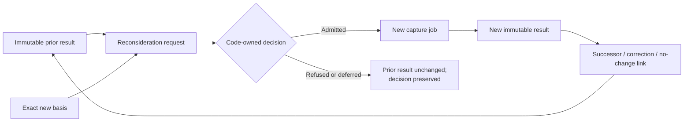

# Phase X: Capture Reconsideration And Successor Contract

**Version:** 0.1.0
**Status:** ENTERED — lawful reconsideration, successor, and deduplication boundaries
are normative; production scheduling and implementation remain unauthorized.
**Parent:** `RFC_DISCOVERY_CAPTURE_OBSERVATION.md`

## 1. Problem

A prior capture result may later become incomplete:

- a referenced antecedent becomes available;
- an unresolved entity receives a governed resolution;
- a source-policy decision changes;
- a dispute receives new material evidence;
- a capture contract or benchmarked execution profile corrects a known failure class;
- a person asks for bounded reconsideration.

The system must revisit such records without rewriting history, treating similarity as
proof, producing infinite rerun loops, or repeatedly charging the same cause as new
work.

## 2. Governing Distinctions

```text
Retry
Same source revision, contract, execution profile, and semantic obligation after a
retryable execution failure. It creates another attempt, not a new semantic result.

Reconsideration
A new governed evaluation of an immutable prior result because a specific material
condition changed or an attributable request was admitted.

Source revision
New canonical source text or metadata. It creates a new ordinary capture obligation and
a successor relationship; it does not reconsider or mutate the old source revision.

Observation successor
A new accepted observation revision that corrects, narrows, expands, or replaces an
earlier accepted observation while preserving both.

Discovery accumulation
New evidence joins a cluster or evidence set without requiring the original source to be
captured again.
```

Later related material normally belongs to discovery accumulation. It triggers capture
reconsideration only when it satisfies an exact unresolved dependency recorded by the
prior result.

## 3. Authority Gate

### Governing contracts

- The Capture Observation RFC governs immutable prior results and source-local claims.
- The vocabulary/source-policy contract governs entity leads and policy changes.
- The batch contract governs new evaluation input and exact manifest identity.
- X.2 will govern durable scheduling, leasing, and reconciliation.

### Authoritative sources

The immutable prior result, its source revision, recorded unresolved dependencies, new
trigger evidence, reconsideration request, code-owned decision, successor job, and
successor result form the chain of custody.

### Projection boundary

Retrieval similarity, cluster proximity, elapsed time, model confidence, UI refresh,
operator curiosity, and a newer model's availability are leads or circumstances. They
are not material change by themselves.

### Lifecycle owner

The server-side reconsideration service owns trigger validation, target matching,
deduplication, cycle refusal, policy caps, admission decisions, and successor linkage.
The capture scheduler may execute only an admitted reconsideration request.

### Failure behavior

Invalid or duplicate triggers are refused without changing the prior result. Missing
dependencies remain pending. Cycles, cap exhaustion, or ambiguous target matching move
to explicit manual review. No failure deletes sources, prior results, observations, or
disputes.

## 4. Closed V1 Trigger Vocabulary

```text
CAPTURE_CONTRACT_CHANGED
An exact successor contract changes a rule material to the prior outcome.

CAPTURE_PROFILE_CHANGED
A separately benchmarked execution profile addresses a recorded failure class or an
authorized migration requires re-evaluation.

ENTITY_RESOLUTION_CHANGED
A governed entity-resolution record resolves or materially changes an exact unresolved
entity lead.

SOURCE_POLICY_CHANGED
A versioned source-policy successor changes eligibility or evidence use for the exact
source revision.

SOURCE_BECAME_AVAILABLE
A source or antecedent previously recorded unavailable can now be retrieved and
validated at an exact revision.

ANTECEDENT_RESOLVED
Exact eligible evidence satisfies a recorded quoted, attributed, summary-origin, or
external-reference dependency.

DISPUTE_MATERIAL_CHANGED
New admissible evidence or an independently governed assessment changes the basis of a
recorded dispute.

HUMAN_RECONSIDERATION_REQUESTED
An attributable person requests a bounded re-evaluation and supplies a reason and any
available basis.
```

`SOURCE_REVISED` is not a reconsideration trigger. It creates a new source-revision
obligation linked to the prior revision. `RELATED_EVIDENCE_APPEARED` is too broad for
automatic execution; it must resolve to `ANTECEDENT_RESOLVED`,
`ENTITY_RESOLUTION_CHANGED`, `SOURCE_BECAME_AVAILABLE`, or
`DISPUTE_MATERIAL_CHANGED` with exact bindings.

## 5. Trigger Eligibility

### Prior `NO_OBSERVATIONS`

May be reconsidered only when:

- a successor capture contract changes source-local qualification;
- a separately benchmarked profile addresses a recorded capture defect;
- source policy changes for the same revision;
- a bounded human request identifies a plausible missed source-local event.

Later topical evidence alone cannot change what the original source locally said.

### Prior `PARTIAL`, `UNKNOWN`, or unresolved lead

May be reconsidered when an exact recorded entity, antecedent, source-availability, or
claim-support dependency receives new governed material.

### Prior `DISPUTED`

May be reconsidered only when the dispute record names new admissible evidence, a new
governed assessment, or a corrected adjudication basis. Repeating one side's prior
position is not material change.

### Prior `UNAVAILABLE`

May be reconsidered when the exact required source becomes available and its revision
and policy eligibility validate.

### Prior `UNVERIFIED`, rejected, or invalid output

Retry handles transient execution failure under the same configuration. Reconsideration
requires a changed contract/profile/policy or an attributable request with a distinct
basis.

### Prior `VERIFIED`

Later evidence normally accumulates downstream. Reconsideration is allowed only to
correct a proven capture/validation defect or apply a material successor contract.
Changed real-world meaning creates a later source event or memory successor, not a
rewrite of the verified historical observation.

## 6. Request And Decision

Every proposed reconsideration creates an immutable request binding:

```text
request identity and deduplication key
target kind, identity, revision, and hash
source record and exact source revision
prior capture contract and execution profile
trigger type
exact trigger-basis records and hashes
recorded dependency identities, when applicable
request origin and authenticated actor, when human
requested successor contract/profile/policy
request time
```

Code then records one immutable decision:

```text
ADMITTED
The trigger is material, matched, nonduplicate, acyclic, and within policy limits.

REFUSED_DUPLICATE
The same target and trigger-basis set already has an authoritative request.

REFUSED_NO_MATERIAL_CHANGE
The supplied basis does not change a recorded dependency or governing input.

REFUSED_TARGET_MISMATCH
The basis, dependency, source, or revision does not match the target.

REFUSED_CYCLE
The request would depend on its own result chain or recreate a prior causal cycle.

REFUSED_POLICY_LIMIT
The automatic successor cap is exhausted.

DEFERRED_MISSING_BASIS
The request is valid in kind but its required governed basis is unavailable.

MANUAL_REVIEW_REQUIRED
Materiality, target identity, conflict, or cycle safety cannot be resolved
deterministically.
```

Only `ADMITTED` creates a successor capture job.

## 7. Deduplication And Loop Prevention

The deduplication key is computed from:

```text
target kind and immutable target identity
target revision/hash
source revision hash
trigger type
normalized sorted trigger-basis record identities and hashes
requested contract/profile/policy identity
reconsideration policy version
```

The actor, request wording, request time, retrieval rank, and UI path do not create a new
semantic basis.

Universal controls:

1. One authoritative decision per deduplication key.
2. Concurrent identical requests converge on that decision.
3. A successor result cannot, by itself, trigger reconsideration of its own ancestor.
4. Reciprocal A-to-B-to-A dependency cycles refuse.
5. Automatic reconsideration requires a new basis hash.
6. A versioned policy sets the maximum automatic successors per source revision.
7. Reaching the cap preserves later requests for manual review; it does not discard
   them or silently continue.
8. Human requests without new basis deduplicate; repeated clicking is not new evidence.

## 8. Successor Semantics

Reconsideration never mutates its target.



Successor outcomes are:

```text
NO_SEMANTIC_CHANGE
New evaluation lawfully reaches the same meaning or zero result.

OBSERVATION_ADDED
A prior zero or incomplete result now supports a new observation.

OBSERVATION_CORRECTED
A successor observation corrects a proven defect in an earlier observation.

OBSERVATION_NARROWED
The successor removes unsupported meaning while retaining the supported core.

OBSERVATION_EXPANDED
Newly resolved source-local support adds bounded meaning.

REMAINS_PARTIAL
Some exact dependency remains unresolved.

REMAINS_DISPUTED
Material assessments still disagree.

REMAINS_UNAVAILABLE
Required source material still cannot be validated.
```

`NO_SEMANTIC_CHANGE` is still a durable result. It prevents repeated identical work but
does not rewrite the original capture record.

## 9. Human Requests

An attributable human may request reconsideration but cannot declare missing evidence
verified, choose a more permissive source policy, change canonical identity, or force a
desired observation.

Ordinary UI asks:

```text
Why should this be reconsidered?
What source or condition changed?
```

If no new governed basis is supplied, the request may enter
`DEFERRED_MISSING_BASIS`, `REFUSED_NO_MATERIAL_CHANGE`, or
`MANUAL_REVIEW_REQUIRED` according to policy. A request concerning an obvious
source-local omission may be admitted as `HUMAN_RECONSIDERATION_REQUESTED`, but the new
result must pass the same source, span, entity, and claim-support gates.

## 10. Operator Projection

The ordinary lifecycle must distinguish:

```text
Reconsideration requested
Waiting for evidence
Reconsideration queued
Reconsideration completed — no change
Reconsideration completed — new observation found
Reconsideration completed — prior observation corrected
Still incomplete
Still disputed
Still unavailable
Reconsideration refused — no material change
Manual review required
```

Every blocked or deferred state states:

```text
Reason: [human-language material condition]
Prior result: [still valid historical state]
Next step: [one lawful action, or none when no action exists]
```

Machine IDs, hashes, dedupe keys, and refusal codes remain diagnostic.

## 11. Normative Requirements

### REC-DIST-001 — Retry is not reconsideration

Same-configuration transient execution attempts MUST remain retries of one job.
Reconsideration requires an admitted material trigger and a new semantic job.

### REC-DIST-002 — Source revision is a new obligation

A changed canonical source revision MUST create a normal successor obligation and MUST
NOT mutate or rerun the prior revision as though its original result were wrong.

### REC-TRG-001 — Closed trigger vocabulary

Every reconsideration request MUST use exactly one trigger from Section 4 and bind the
trigger-specific governed basis.

### REC-TRG-002 — Related evidence must match a dependency

Later evidence MUST resolve an exact recorded dependency before it may automatically
trigger capture reconsideration. Similarity or shared topic is insufficient.

### REC-TRG-003 — Zero-result protection

A prior `NO_OBSERVATIONS` MUST NOT be reconsidered merely because later conversation is
important. The trigger must change source-local qualification, policy/profile behavior,
or supply a bounded attributable missed-event request.

### REC-REQ-001 — Immutable request

Every request MUST preserve exact target, source revision, trigger basis, requested
governing inputs, origin, actor when applicable, time, and deduplication key.

### REC-DEC-001 — Code-owned admission

Only the server reconsideration policy may admit, refuse, defer, or route a request to
manual review. Browser and model output cannot create a successor job directly.

### REC-DED-001 — One decision per semantic basis

Identical target and normalized trigger basis MUST converge on one authoritative
request/decision regardless of actor wording, time, or number of submissions.

### REC-DED-002 — New basis required

Automatic reconsideration MUST require a trigger-basis hash not already consumed by the
target chain.

### REC-CYC-001 — Causal cycles refuse

Self-dependent and reciprocal reconsideration cycles MUST refuse without mutating any
prior result or consuming unrelated source obligations.

### REC-CAP-001 — Bounded automatic successors

A versioned policy MUST cap automatic successors per source revision. Cap exhaustion
routes later material requests to explicit manual review.

### REC-SUC-001 — Immutable successor

Every completed reconsideration MUST create a new immutable result linked to the target,
request, decision, job, contract, profile, and exact basis.

### REC-SUC-002 — No-change is durable

A lawful no-change outcome MUST be recorded and deduplicated; it MUST NOT erase or
replace the prior result.

### REC-SUC-003 — Corrected meaning preserves history

Correction, narrowing, expansion, or new observation MUST preserve the original result
and create explicit lineage rather than mutation.

### REC-HUM-001 — Human request is not verification

An attributable reconsideration request MAY require a new evaluation but MUST NOT
establish source truth, span validity, identity, claim support, or desired output.

### REC-AUD-001 — Replayable custody

Restart/replay MUST reconstruct requests, decisions, deduplication, consumed bases,
causal lineage, policy caps, jobs, and successor outcomes identically.

### REC-FAIL-001 — Failure preserves obligations

Refused, deferred, cyclic, capped, failed, or unavailable reconsideration MUST preserve
all prior records and any still-unsatisfied source obligations.

### REC-UI-001 — Visible lifecycle

Ordinary UI MUST show whether reconsideration is requested, waiting, queued, completed,
unchanged, changed, refused, or manual, plus one lawful next action when one exists.

## 12. Schema Consequences

New contract artifacts:

```text
capture-reconsideration-request-v1.schema.json
capture-reconsideration-decision-v1.schema.json
```

`capture-job-state-v1` and `accepted-observation-record-v1` gain an optional
`reconsiderationRequestId` so successor execution and results retain custody without
changing initial-capture records.

`capture-source-disposition-v1` uses the narrowed v1 trigger vocabulary. A
`SOURCE_REVISED` marker remains a successor-obligation signal, not reconsideration of
the old revision.

## 13. Required Proof Before Implementation Closure

1. A transient timeout retries one job and creates no reconsideration request.
2. A new source revision creates a new obligation while preserving the old result.
3. Exact antecedent resolution admits reconsideration of the bound partial observation.
4. Merely similar evidence does not reconsider a zero result.
5. Two concurrent identical requests produce one decision and at most one successor job.
6. A new trigger-basis hash may create a later lawful successor.
7. A successor cannot trigger its own ancestor, directly or through a reciprocal cycle.
8. Automatic cap exhaustion routes to manual review without evidence loss.
9. Human request wording cannot force a desired observation.
10. No-change, corrected, narrowed, expanded, partial, disputed, and unavailable
    outcomes preserve complete lineage.
11. Restart/replay reconstructs the same consumed bases, caps, decisions, and outcomes.
12. Ordinary UI explains the state without exposing internal identifiers.

## 14. Stop Boundary

This contract does not authorize reconsideration scheduling, related-evidence matching,
entity resolution, UI controls, source mutation, model execution, automatic migration,
or X.2 queue implementation.

## 15. Status

The trigger, admission, deduplication, cycle, cap, successor, audit, and projection
boundaries are **ENTERED**. Production implementation and operational proof remain open.
