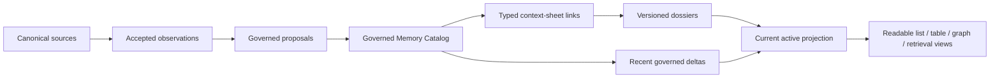

# Phase X: Memory Catalog And Context Sheet Parent Architecture Contract

**Version:** 0.1.0
**Status:** ENTERED — parent architecture and derivation boundaries are normative;
schemas, migration, UI, retrieval wiring, and production implementation remain
unauthorized.
**Semantic parent:** `PHASE_X_MEMORY_FORMATION_OPERATIONAL_MODEL.md`
**Machine parents:** `PHASE_X_MEMORY_DISCOVERY_AND_GOVERNANCE_REBASE_CONTRACT.md`,
`RFC_DISCOVERY_CAPTURE_OBSERVATION.md`, and the existing governance lifecycle
contracts.

## 1. Problem

The discovery contracts explain how exact source material becomes observations,
evidence sets, proposals, and governed memory. They do not yet define how many
governed events become useful long-term continuity.

Without a parent architecture, implementation could make any of these mistakes:

- treat one event as the finished memory product;
- replace exact history with a generated dossier;
- use a dossier title as canonical identity;
- silently smooth contradictions into agreeable prose;
- overwrite a sealed memory when its meaning evolves;
- make `Lore`, `Topics`, or `Goals` the entire data model;
- confuse retrieval priority with authority or conflict precedence;
- require the operator to manually compose continuity from hundreds of records;
- produce readable prose that cannot be reproduced from exact governed claims.

The required product combines:

```text
automatic and simple capture
+ exact and immutable evidence
+ governed meaning
+ subject and shared-subject jurisdiction
+ evolving long-term continuity
+ human-readable presentation
+ reproducible derivation
```

## 2. Governing Product Distinction

The system has four different semantic products:

```text
Governed event memory
An immutable, source-bound, jurisdiction-scoped event or meaning admitted through the
governance lifecycle.

Context sheet
A stable semantic anchor that groups governed events around an entity, relationship,
group, place, object, topic, goal, project, motif, ritual, or era.

Versioned dossier
A human-readable, claim-structured interpretation of one context sheet at a specific
revision, derived from governed catalog entries and explicit lineage.

Current active projection
The bounded continuity view that may participate in ordinary recall or prompt context.
It is composed from the active dossier revision plus eligible recent governed events
not yet incorporated into that dossier.
```

These products are not interchangeable:

```text
governed event memory
!= context sheet
!= dossier revision
!= current active projection
```

The practical chain is:



## 3. Derivation From The Semantic Spine

This contract preserves these parent distinctions:

| Human need | Architectural boundary | Product consequence | Failure prevented |
|---|---|---|---|
| Remember what happened | Immutable governed catalog entry | Exact history survives | Dossier prose replaces evidence |
| Understand what it means over time | Versioned context-sheet dossier | Meaning may accumulate and evolve | Operator must mentally merge events |
| Preserve agency | Jurisdiction remains attached to every claim and revision | No dossier authors another subject's meaning | Convenient synthesis bypasses autonomy |
| Change without falsifying history | Successor and supersession lineage | Earlier truth remains visible | Silent rewriting |
| Use continuity before the next synthesis run | Active dossier plus recent eligible deltas | Newly governed events can participate promptly | Stale continuity window |
| Trust the result | Claim-level derivation and reproducible inputs | Every sentence can be audited | Attractive but unprovable summaries |
| Keep the ordinary workflow simple | Human views hide machine custody by default | Review focuses on meaning and action | Interface machinery becomes the work |

## 4. Authority Gate

### Governing contracts

- The frozen operational model governs human purpose and finish lines.
- Discovery contracts govern canonical source custody, accepted observations,
  evidence, readiness, and proposal formation.
- Existing governance contracts govern admission, disposition, publication,
  withdrawal, correction, supersession, replay, and recovery.
- This contract governs the catalog, context-sheet, dossier, and active-projection
  boundaries after governed admission.

### Authoritative sources

1. Canonical source revisions remain authority for what was said or done.
2. Existing governance ledgers remain authority for whether a proposed meaning was
   admitted and what lifecycle state it holds.
3. The Memory Catalog owns the immutable registry and lineage of governed memory
   entries.
4. Context-sheet identity records own stable semantic anchors and aliases.
5. Typed membership-link records own the asserted relationship between a catalog entry
   and a context sheet.
6. Dossier revision records own a bounded, reproducible synthesis at one revision.
7. Activation records own whether a catalog entry, dossier revision, or projection
   component may participate in current continuity.

### Projection boundary

Generated prose, dossier titles, graph layout, table ordering, search results,
embeddings, similarity scores, reranker results, inferred clusters, UI categories, and
the assembled active-context payload are projections. They do not create evidence,
identity, jurisdiction, agreement, lifecycle authority, or conflict precedence.

### Lifecycle owners

```text
Existing governance lifecycle
  admission, disposition, publication, correction, withdrawal, supersession

Memory Catalog service
  immutable catalog identity, locator assignment, lifecycle projection, lineage

Context Sheet service
  anchor identity, aliases, typed membership links, merge/split proposals

Dossier service
  readiness, claim synthesis, revision lineage, incorporation tracking

Active Continuity service
  eligible dossier revision plus bounded recent governed deltas

Retrieval service
  candidate selection and ranking only
```

### Failure behavior

- Missing or invalid authority bindings refuse catalog admission.
- Ambiguous anchor identity remains unresolved; similarity cannot merge anchors.
- Unsupported membership links remain nominated, disputed, or refused.
- Unsupported dossier claims refuse the revision without changing prior revisions.
- Contradictory governed entries remain visible and cannot be smoothed away.
- Failed dossier refresh preserves the current active revision and exposes eligible
  unincorporated deltas.
- Replay uncertainty refuses projection advancement rather than inventing lineage.

## 5. Memory Catalog

The Memory Catalog is the durable registry of governed events. It is not limited to
currently active or agreeable material.

The catalog includes entries that are:

```text
ACTIVE
HISTORICAL
CORRECTED
DISPUTED
WITHDRAWN
SUPERSEDED
UNRESOLVED
```

Each catalog entry binds at minimum:

```text
immutable catalog identity
stable human citation locator
memory scope
governance track and jurisdiction
subject and materially affected subjects
exact admitted proposal revision
governed evidence-set identity and hash
source-manifest lineage
lifecycle state and effective interval
activation state
successor, correction, withdrawal, and supersession links
creation and disposition custody
```

The catalog preserves what was governably established at a point in time. A later
correction or change creates lineage; it does not mutate the prior entry.

### Human citation locators

The ordinary citation form MAY be `[M#]`.

- A locator is immutable within its declared namespace.
- A locator is never recycled.
- The canonical identity is not the display locator.
- Imported scopes with colliding locators retain their original namespace and receive
  an unambiguous local display mapping.
- A UI may change how a locator is displayed without changing the catalog identity.

## 6. Context Sheets

A context sheet is a stable semantic anchor, not a prose document and not a lifecycle
authority.

The closed parent vocabulary is:

```text
ENTITY
RELATIONSHIP
GROUP
PLACE
OBJECT
TOPIC
GOAL
PROJECT
MOTIF
RITUAL
ERA
```

`Lore`, `Topics`, and `Goals` are useful navigation views:

```text
Lore
  common view over entities, relationships, groups, places, objects, motifs, rituals,
  and eras

Topics
  common view over topics and projects, with lawful cross-links to other sheet types

Goals
  common view over goals and related relationships, groups, entities, and projects
```

They are not the canonical type system. A product may add or reorganize views without
changing context-sheet identity or catalog authority.

Each sheet binds:

```text
immutable sheet identity
memory scope
sheet type
canonical anchor identity or governed unresolved-anchor state
human display title and aliases
jurisdiction constraints
creation basis
merge, split, redirect, and retirement lineage
current dossier revision, if one exists
```

Display titles and aliases are mutable projections. They cannot merge two anchors or
change identity by themselves.

## 7. Typed Membership Links

One catalog entry may lawfully inform multiple context sheets. The catalog entry is not
duplicated; each relationship is recorded as its own typed, evidence-bearing link.

The initial link vocabulary is:

```text
DIRECT
The governed entry directly concerns the sheet's canonical anchor.

ATTRIBUTED
The entry contains an eligible attribution concerning the anchor; any unresolved
antecedent remains explicit.

INTERPRETIVE
The entry supports a governed interpretation associated with the sheet but does not
directly establish the anchor or every broader claim.

HISTORICAL
The entry establishes an earlier state, transition, or lineage relevant to the sheet.

CONTRADICTORY
The entry materially conflicts with an existing claim or entry associated with the
sheet.
```

Every link binds:

```text
catalog entry and exact revision
context sheet and exact anchor identity
link type
claim-level basis
jurisdiction
creator and creation method
validation state
successor or removal lineage
```

Co-occurrence, embedding similarity, model confidence, or shared keywords may nominate
a link. They cannot validate it.

## 8. Motifs And Meaning-Bearing Recurrence

A motif is not a decorative keyword and not every repeated noun.

A `MOTIF` sheet requires:

1. multiple governed occurrences, unless a governing contract explicitly permits a
   deliberate subject- or operator-seeded provisional sheet;
2. exact occurrence links;
3. a bounded claim about the motif's contextual meaning;
4. evidence of recurrence, evolution, contrast, or changed significance;
5. jurisdiction appropriate to the subjects and shared world involved.

The system must distinguish:

```text
Repeated object or word
  retrieval lead only

Recurring symbol with governed contextual meaning
  eligible motif evidence

Changed meaning of an existing symbol
  eligible dossier successor basis
```

## 9. Versioned Dossiers

A dossier is a readable synthesis over one context sheet and a declared catalog basis.
It is not the source of the governed events it describes.

Each dossier revision binds:

```text
context-sheet identity
revision identity and parent revision
exact included catalog entries and revisions
exact included membership-link revisions
claim graph
rendered human-language presentation
jurisdiction and policy snapshot
synthesis contract, prompt, model, and execution manifest
code-owned validation results
incorporation watermark or equivalent closed basis
revision class and rationale
creation time and custody
```

### Claim-level structure

Readable prose is rendered from structured claims. Every material claim binds:

```text
claim identity
claim text or normalized proposition
applicable subject and jurisdiction
supporting catalog locators
limiting or contradictory catalog locators
temporal applicability
confidence or uncertainty state when contractually allowed
predecessor and successor claim links
```

A paragraph-level bibliography is insufficient when one sentence contains multiple
material claims.

### Revision classes

The initial dossier revision classes are:

```text
CONTENT_ADDITION
MEANING_REVISION
CORRECTION
NARROWING
HISTORICAL_TRANSITION
STRUCTURAL_REORGANIZATION
RESTORE
ACTIVATION_CHANGE
```

Editing a dossier creates a successor revision. It never edits the catalog evidence or
overwrites the prior dossier revision.

Restoring an earlier presentation creates a new revision with `RESTORED_FROM` lineage;
it does not make the intervening history disappear.

### Meaningful-delta rule

A new governed catalog entry does not automatically require prose churn.

The dossier service creates a revision only when the declared policy finds a material
delta to at least one:

- claim;
- temporal state;
- subject or jurisdiction;
- contradiction;
- goal state;
- motif meaning;
- relationship structure;
- activation consequence;
- human-readable organization necessary for clarity.

Otherwise the catalog entry and membership link remain incorporated or pending
incorporation without producing a semantically empty dossier revision.

## 10. Contradiction, Correction, And Evolution

Contradiction is first-class evidence, not prose noise.

The dossier must preserve the difference between:

```text
Correction
The earlier record or interpretation was wrong.

Evolution
The earlier state was valid then and later changed.

Dispute
Material admissible positions remain unresolved.

Narrowing
Part of a claim lacked support, while a smaller claim remains valid.

Supersession
A named later claim or revision replaces a named earlier one within explicit scope.
```

No synthesis process may “smooth” these into a single timeless statement. Current
prose may emphasize the active state only when it also retains the historical and
contradictory lineage required to explain how that state was reached.

## 11. Activation, Salience, And Precedence

These are three independent dimensions.

### Activation

```text
DORMANT
Retained and governable, but excluded from ordinary active continuity.

ACTIVE
Eligible for current continuity within its jurisdiction and policy.
```

### Retrieval salience

```text
LOW
STANDARD
HIGH
```

Salience affects ranking or retrieval budget. It does not establish truth, authority,
activation, or precedence.

### Conflict precedence

Precedence requires an explicit governed relationship such as:

```text
SUPERSEDES
OVERRIDES
CORRECTS
NARROWS
```

It must name the exact target claim or revision, scope, jurisdiction, effective time,
and authority basis. A generic `OVERRIDE` priority is prohibited.

## 12. Current Active Projection

Continuity must not remain stale while a dossier refresh is pending.

The current active projection is:

```text
current eligible active dossier revision
+ eligible active governed catalog entries linked to the sheet
  but not yet incorporated into that dossier revision
- entries or claims made ineligible by exact lifecycle or activation records
```

Each delta carries an incorporation state:

```text
UNINCORPORATED
SELECTED_FOR_REVISION
INCORPORATED
NO_DOSSIER_CHANGE_REQUIRED
BLOCKED
```

The projection must:

- prevent the same event from appearing as both incorporated prose and an
  unincorporated delta;
- preserve contradictions and uncertainty;
- remain within token and jurisdiction policy;
- record the exact assembly manifest;
- fail closed when lifecycle or scope cannot be reconstructed;
- distinguish recent evidence from synthesized dossier language in diagnostics.

## 13. Scope And Contextual Jurisdiction

Context sheets are bound to a memory scope. Cross-scope relationships require an
explicit authorized link; similarity cannot bridge private scopes.

The same words may carry different jurisdiction:

```text
Shared-world or roleplay claim
  true within the governed shared-world scope

Personal self-interpretation
  governed within the subject's self-subject jurisdiction

Shared relationship meaning
  governed only through the applicable shared-subject lifecycle

External factual claim
  requires evidence and policy appropriate to external-world assertion
```

A dossier must not silently promote a shared-world event into an external factual
claim, or collapse one subject's interpretation into mutually governed meaning.

Each private one-to-one or group memory scope may have its own catalog projection and
context sheets. Cross-chat or cross-group continuity is allowed only through the
existing source-policy and scope contracts.

## 14. Automatic And Manual Formation

Context-sheet and dossier formation supports two lawful initiation paths:

```text
Automatic
Governed catalog accumulation reaches a versioned formation/readiness rule.

Manual seed
An authorized subject or operator requests a sheet or dossier around named material.
```

Manual seeding creates a formation obligation or nominated anchor. It does not:

- fabricate catalog evidence;
- bypass anchor resolution;
- establish another subject's meaning;
- force a dossier claim;
- activate the result;
- override contradiction or lifecycle policy.

The ordinary happy path is:

```text
conversation happens
-> meaningful developments are captured automatically
-> governed events accumulate around understandable anchors
-> dossiers update when meaning materially changes
-> the appropriate participant reviews only decisions requiring authority
-> current continuity becomes useful without exposing orchestration machinery
```

## 15. Reproducibility And Replay

Every dossier revision and active projection must be reproducible from recorded inputs.

Reproduction binds:

```text
catalog and link revisions
canonical evidence and governance lineage
policy and contract versions
prompt and model artifact identity
execution parameters
deterministic code version
validation outcomes
human corrections or seeds
assembly manifest
```

Model reruns are not assumed byte-identical. Reproducibility means the system can prove
the exact inputs and mechanism that produced the accepted artifact, revalidate its
claims, and reconstruct authoritative lifecycle and projection state without relying
on mutable browser memory or generated prose alone.

Restart/replay must reconstruct:

- catalog identity and citation mappings;
- lifecycle and activation state;
- sheet anchors and aliases;
- typed membership links;
- dossier revision lineage and claim citations;
- incorporation state;
- active-projection assembly;
- pending, disputed, blocked, and failed work.

## 16. Ordinary Product Views

Graph, table, catalog, and dossier screens are views over the same governed records.

### Dossier view

Shows:

- human title;
- current state and applicable subjects;
- readable current synthesis;
- meaningful changes over time;
- source-preview affordances for material claims;
- contradictions or unresolved meaning;
- one lawful action when action is required.

### Table or catalog view

Shows:

- readable event or sheet title;
- type;
- subjects;
- lifecycle and activation state;
- created/changed time;
- concise next action.

### Graph view

Shows context sheets and typed relationships. Layout, distance, color, and node size are
visual projections only.

### Technical view

May expose identities, hashes, manifests, policies, and lineage. Machine custody must
not clutter the ordinary workflow.

The clarity gate is:

> Any ordinary-workflow element that does not provide insight, direction, feedback, or
> movement must be removed from that workflow.

## 17. Normative Requirements

### CAT-SEP-001 — Four products remain distinct

Catalog entries, context sheets, dossier revisions, and active projections MUST remain
separate linked records with separate owners and lifecycle effects.

### CAT-AUTH-001 — Catalog admission requires governance

Only a governed admission or lawful governed successor MAY create a Memory Catalog
entry. Capture, clustering, retrieval, or dossier synthesis cannot create one.

### CAT-HIST-001 — Catalog history is immutable

Correction, withdrawal, dispute, activation change, and supersession MUST append exact
lineage and MUST NOT overwrite a prior catalog entry.

### CAT-LOC-001 — Human locators are stable and namespaced

Human citation locators MUST be immutable, non-recycled, namespace-bound aliases of
canonical catalog identities.

### SHE-TYP-001 — Context-sheet type is closed and independent of view

Every context sheet MUST use one type from Section 6. `Lore`, `Topics`, and `Goals`
MUST remain navigation views rather than canonical authority types.

### SHE-ID-001 — Titles are not identities

Changing a title or alias MUST NOT merge, split, or replace a canonical anchor.

### SHE-LNK-001 — Membership is typed and claim-bound

Every catalog-to-sheet relationship MUST use one link type from Section 7 and bind its
claim-level governed basis.

### SHE-LNK-002 — Similarity nominates only

Co-occurrence, embeddings, reranking, model output, and shared vocabulary MAY nominate
a membership link but MUST NOT validate it.

### SHE-JUR-001 — Jurisdiction survives aggregation

Context sheets and dossiers MUST preserve the subject, shared-subject, shared-world,
and external-fact jurisdiction of their contributing claims.

### SHE-MOT-001 — Motifs require governed recurrence and meaning

A non-provisional motif MUST bind multiple exact governed occurrences and a supported
contextual-meaning claim. Repeated vocabulary alone is insufficient.

### DOS-BAS-001 — Dossier basis is closed and exact

Every dossier revision MUST bind the exact catalog entries, link revisions, policy,
contract, execution manifest, and incorporation boundary used to produce it.

### DOS-CLM-001 — Material claims are individually traceable

Every material dossier claim MUST bind supporting, limiting, and contradictory catalog
entries as applicable.

### DOS-HIST-001 — Editing creates a successor

Manual or automatic dossier editing MUST create an immutable successor revision.
Restore MUST create `RESTORED_FROM` lineage rather than delete intervening revisions.

### DOS-DEL-001 — No meaningless revision churn

A new dossier revision MUST record a material delta under Section 9. Catalog
incorporation without a material semantic delta MUST NOT fabricate changed meaning.

### DOS-CON-001 — Contradictions remain visible

Synthesis MUST NOT silently smooth correction, evolution, dispute, narrowing, or
supersession into one timeless claim.

### ACT-SEP-001 — Activation, salience, and precedence are independent

Changing retrieval salience MUST NOT change activation or conflict precedence.
Precedence MUST bind an exact target, scope, jurisdiction, effective time, and governed
authority basis.

### ACT-CUR-001 — Current continuity includes eligible deltas

The current active projection MUST combine the current eligible dossier revision with
eligible active catalog entries not yet incorporated, without duplication.

### ACT-MAN-001 — Projection assembly is reproducible

Every active projection MUST preserve an exact assembly manifest and MUST refuse
advancement when lifecycle, scope, or incorporation state cannot be reconstructed.

### FORM-AUTO-001 — Formation is automatic but non-authoritative

Accumulation rules MAY automatically create sheet or dossier work, but automatic
formation MUST NOT create catalog authority, subject agreement, activation, or
precedence.

### FORM-MAN-001 — Manual seed is an obligation, not proof

A manual seed MUST preserve its attributable requester and selected basis, but MUST NOT
establish evidence, anchor identity, another subject's meaning, activation, or desired
dossier wording.

### REP-001 — Accepted artifacts preserve derivation

Every accepted dossier revision and active projection MUST preserve sufficient inputs,
versions, manifests, validation outcomes, and human actions to reproduce and audit its
derivation.

### UI-CLR-001 — Ordinary views are human and actionable

Ordinary views MUST expose the readable meaning, current state, source-preview path,
material contradiction, and one lawful next action when needed. Machine identifiers
and custody details MUST remain diagnostic unless they provide necessary operator
movement.

## 18. Required Child Contracts

This parent contract does not select storage tables or API shapes. Implementation
requires bounded child contracts for:

1. Memory Catalog record, citation namespace, and lifecycle projection.
2. Context-sheet anchor identity, aliases, merge, split, redirect, and retirement.
3. Typed membership-link nomination, validation, correction, and replay.
4. Dossier claim graph, revision classes, synthesis readiness, and meaningful delta.
5. Activation, salience, precedence, and active-projection assembly.
6. Catalog and context-sheet ordinary UX, source preview, and clarity acceptance tests.
7. Migration of existing governed memories and review/publication records.
8. Benchmark governance for sheet association, motif recognition, dossier fidelity,
   contradiction preservation, and revision usefulness.

Each child contract must map its requirements to the practical distinctions in this
document and the frozen operational model.

Entered child contracts:

1. `PHASE_X_MEMORY_CATALOG_RECORD_CITATION_AND_LIFECYCLE_PROJECTION_CONTRACT.md`
   governs catalog admission, immutable registration, citation namespaces, existing
   lifecycle derivation, replay, and reconciliation.
2. `PHASE_X_CONTEXT_SHEET_ANCHOR_IDENTITY_AND_LIFECYCLE_CONTRACT.md` governs
   context-sheet identity, aliases, unresolved anchors, merge, split, redirects,
   retirement, restoration, and replay.
3. `PHASE_X_CONTEXT_SHEET_MEMBERSHIP_LINK_CONTRACT.md` governs typed
   catalog-to-sheet membership nomination, validation, claim basis, correction,
   merge/split impact, and replay.
4. `PHASE_X_VERSIONED_DOSSIER_CLAIM_GRAPH_AND_REVISION_CONTRACT.md` governs dossier
   basis closure, claim authority, synthesis readiness, meaningful delta, revisions,
   incorporation, rendering, and replay.
5. `PHASE_X_ACTIVE_CONTINUITY_ASSEMBLY_AND_PRECEDENCE_CONTRACT.md` governs
   activation, salience, precedence, active sheet projection, governed deltas,
   deterministic budgeted assembly, injection, and replay.
6. `PHASE_X_CATALOG_CONTEXT_SHEET_AND_DOSSIER_UX_CONTRACT.md` governs ordinary
   navigation, lifecycle visibility, evidence preview, source navigation, actions,
   scale, accessibility, diagnostics, and the Clarity Principle.
7. `PHASE_X_EXISTING_MEMORY_CATALOG_MIGRATION_CONTRACT.md` governs legacy artifact
   classification, additive catalog registration, citation allocation, lifecycle and
   evidence preservation, cutover, rollback, quarantine, and replay.
8. `PHASE_X_CATALOG_CONTEXT_DOSSIER_BENCHMARK_GOVERNANCE_CONTRACT.md` governs
   downstream candidate profiles, human gold, locked holdout, error severity, semantic
   and deterministic metrics, integrated journeys, UX comprehension, and selection.

## 19. Required Proof Before Implementation Closure

1. One governed event enters the catalog once and may link to several sheets without
   duplicating authority.
2. A retrieved but ungoverned observation cannot enter the catalog.
3. Imported citation collisions remain unambiguous and no locator is recycled.
4. Renaming a sheet changes no canonical anchor.
5. Similarity may nominate but cannot validate a sheet link.
6. Roleplay/shared-world claims cannot become external factual claims through
   aggregation.
7. A motif requires governed recurrence and supported contextual meaning.
8. Every material dossier claim resolves to exact catalog evidence.
9. Contradictory governed entries remain visible in claims and ordinary presentation.
10. Correction and evolution produce different lineage and readable outcomes.
11. Manual and automatic edits create dossier successors; restoration preserves all
    intervening revisions.
12. A catalog event with no meaningful dossier delta causes no prose churn.
13. Changing salience cannot activate an item or override a conflict.
14. Explicit precedence affects only the exact governed target and scope.
15. A recent active governed event participates in current continuity before dossier
    refresh and appears exactly once after incorporation.
16. Failed refresh preserves the prior dossier and exposes the eligible pending delta.
17. Restart/replay reconstructs catalog, sheets, links, dossiers, incorporation, and
    active projection identically.
18. Manual seeding cannot manufacture evidence or another subject's meaning.
19. Graph and table views change no authority.
20. Ordinary UI explains current meaning, evidence, lifecycle, contradiction, and next
    action without requiring machine identifiers.

## 20. Stop Boundary

This contract does not authorize:

- schemas, migrations, tables, routes, services, jobs, prompts, or model execution;
- automatic catalog admission;
- context-sheet creation or association;
- dossier synthesis or editing;
- active-context injection;
- graph, table, catalog, or dossier UI;
- changes to existing governance behavior;
- Nomi-compatible data import or product imitation;
- numeric accumulation thresholds, token budgets, or model selection.

Those require separately authorized child contracts, benchmark evidence, bounded
implementation slices, and exact proof.

## 21. Status

The Memory Catalog, context-sheet, typed-link, dossier, contradiction, activation,
projection, reproducibility, and clarity boundaries are **ENTERED**.

Production behavior is unchanged. The slice stops at parent architecture.

## 22. Documentation Closure

The reconciled parent-and-child contract stack is recorded in
`PHASE_X_MEMORY_CATALOG_AND_CONTEXT_SHEET_DOCUMENTATION_CLOSURE_REPORT.md`.

Documentation closure means the required architectural jurisdictions are entered and
cross-checked. It does not authorize schemas, production implementation, migration,
benchmark execution, or release.

## 23. Entered Implementation-Preparation Contract

`PHASE_X_MEMORY_CATALOG_AND_CONTEXT_SHEET_SCHEMA_SUITE_CONTRACT.md` governs the
future schema suite's shared envelope, identity and reference boundaries, artifact
families, compatibility, validation, evolution, and refusal behavior.

Its entry authorizes no JSON Schema artifact or production implementation.
