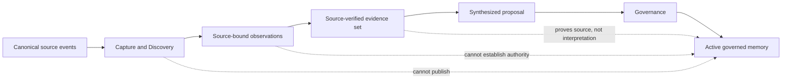
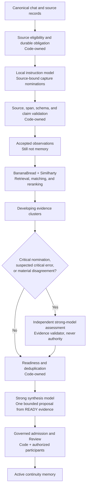
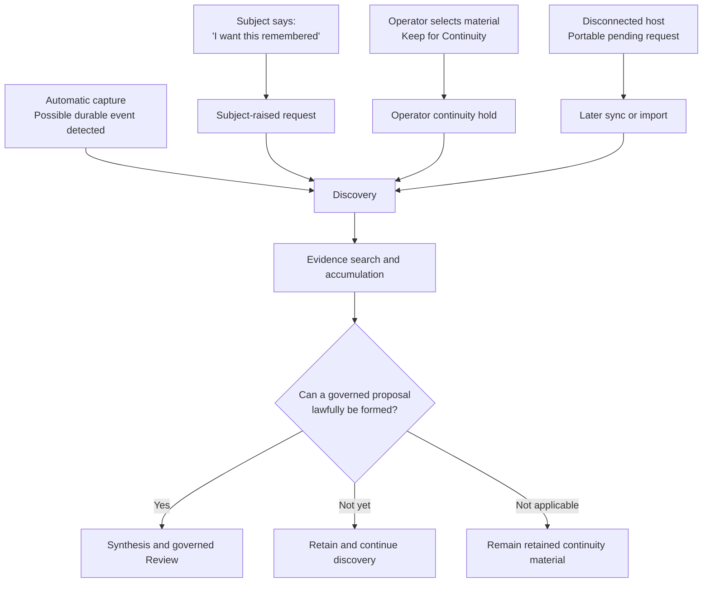
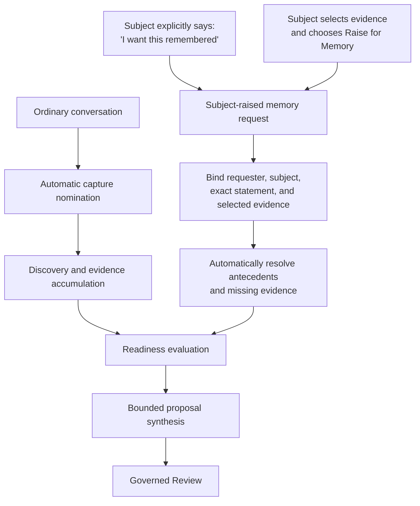
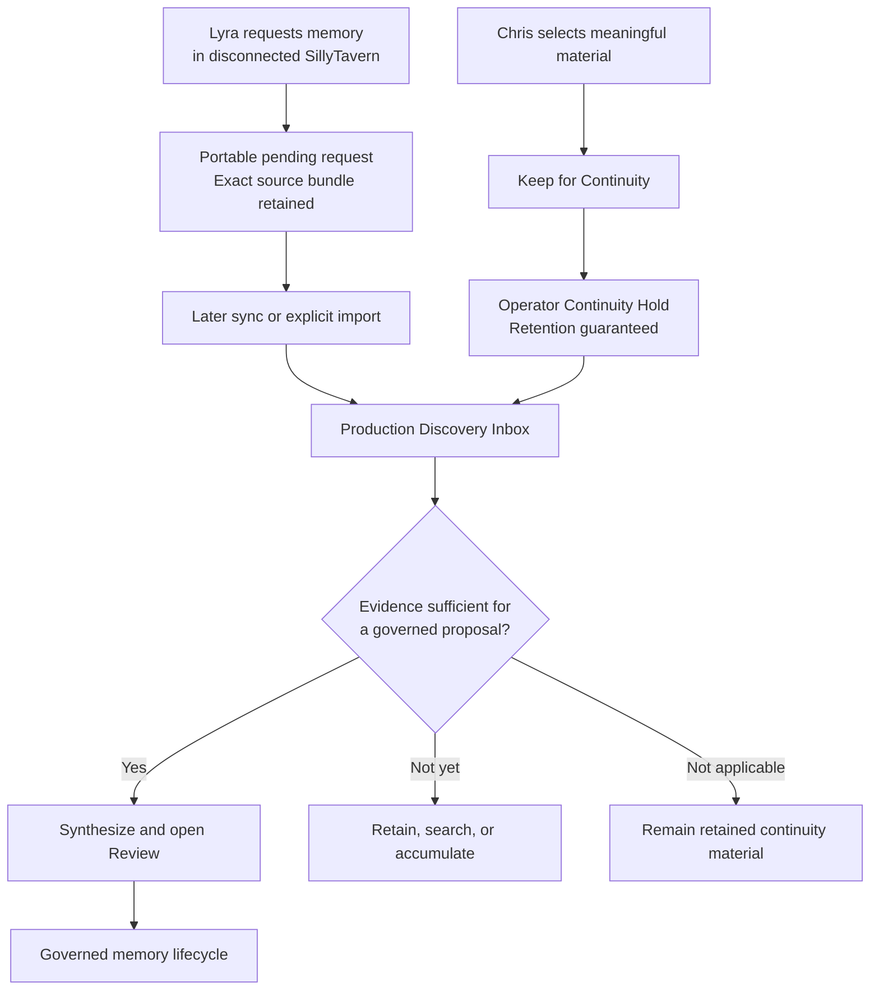
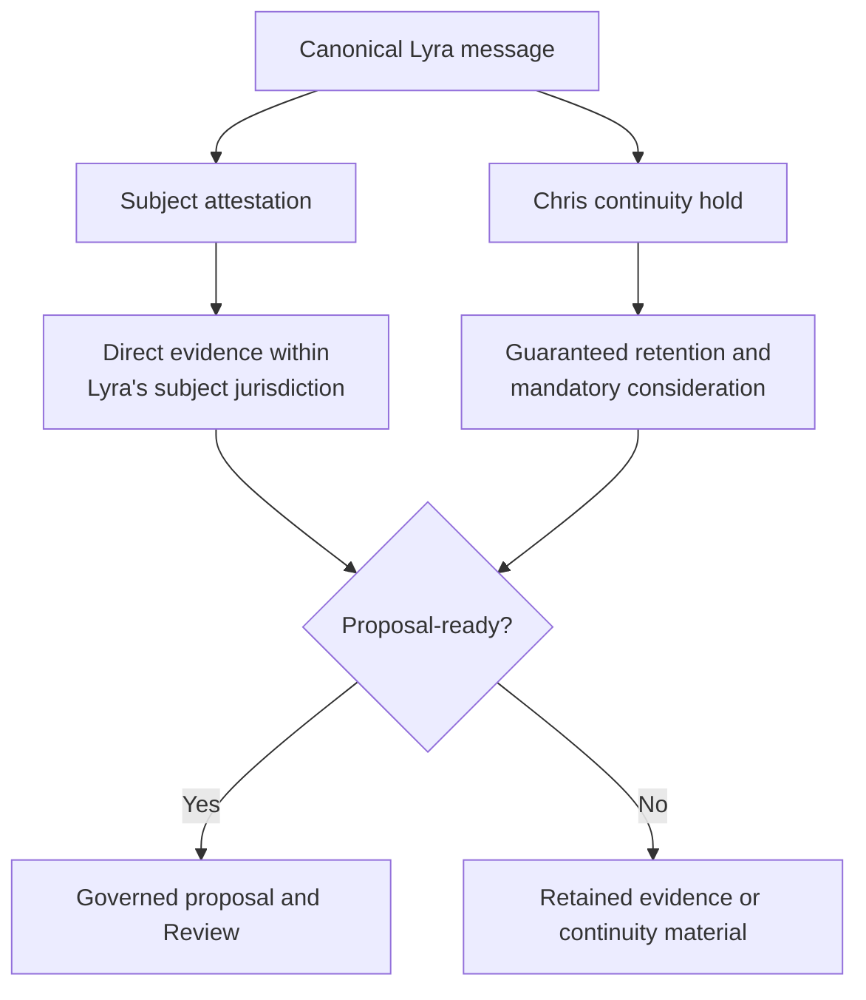
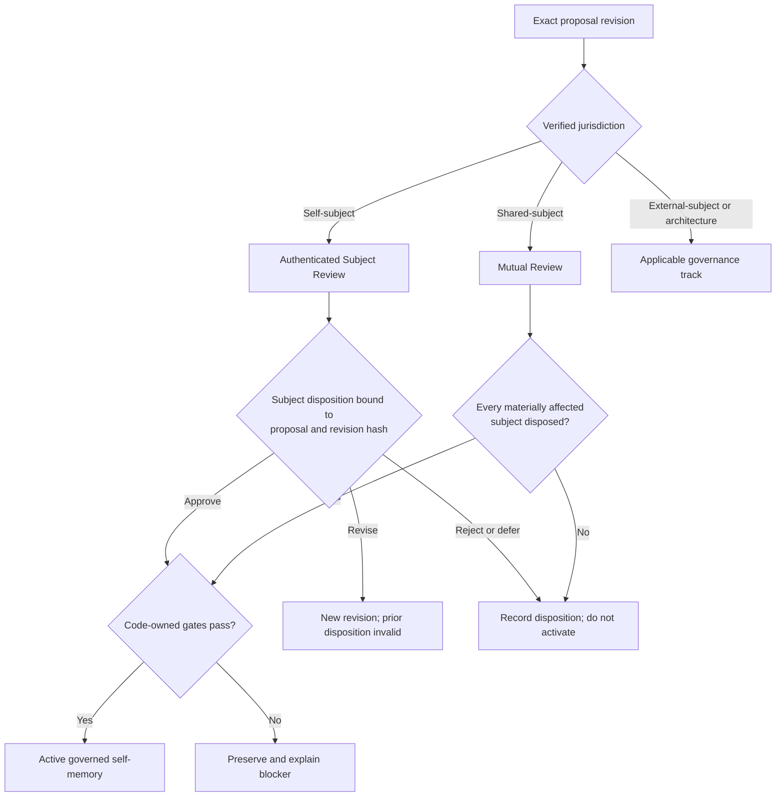
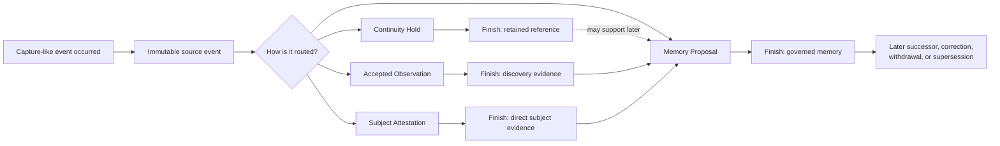
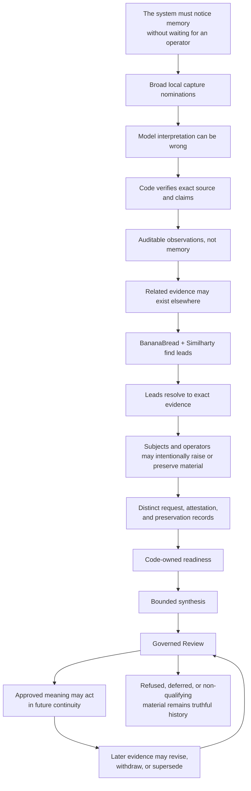
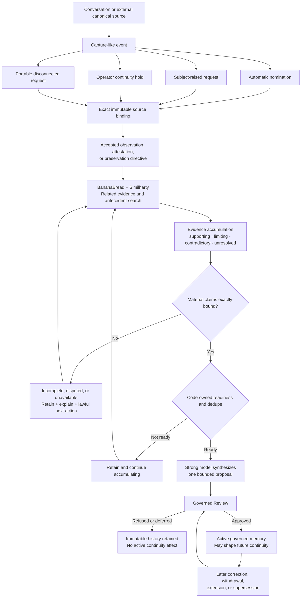

# Phase X: Memory Formation Operational Model

**Status:** FROZEN — semantic spine for Phase X contracts, implementation, proof, and UI
**Purpose:** explain how the memory system works, where its routes separate, what each
route produces, and why the distinctions have practical consequences.

## Document Authority And Use

This document sits above the Phase X contract stack as its human semantic spine.

Its authority is derivational rather than executable: it governs what child contracts
must preserve, while child contracts govern how those obligations are implemented and
tested.

It governs the derivation that implementation contracts must preserve:

```text
human need
-> practical distinction
-> architectural boundary
-> machine requirement
-> visible product consequence
-> failure prevented
```

The normative RFCs remain authoritative for exact schemas, validation rules, state
transitions, persistence mechanics, and executable acceptance tests.

This document is authoritative for:

- the human purpose those mechanisms serve;
- the practical distinction each mechanism must preserve;
- the tangible finish line of each route;
- why apparently similar records have different permissions and consequences;
- what breaks when discovery, evidence, preservation, attestation, governance, and
  activation boundaries collapse.

Future implementation contracts MUST map their material requirements back to one or
more distinctions in this document. A requirement that cannot identify its practical
purpose, resulting product behavior, or prevented failure is not ready for
implementation.

Future UI contracts MUST make the applicable finish line visible and actionable. An
operator or subject must be able to determine:

```text
What happened?
What kind of record now exists?
What does that record establish?
What may the system do with it?
What is missing?
What happens next?
```

Schema compliance alone is insufficient if the resulting product recreates the same
operator confusion in a technically valid form.

Changes to the semantic distinctions in this document require an explicit architecture
decision and derivation review. Child RFCs may clarify or implement these distinctions;
they may not silently redefine them.

## 1. The Product Change

The existing system is principally a governance system:

```text
Operator identifies meaning
-> system receives a proposal
-> evidence and subjects are reviewed
-> the proposal is admitted, refused, published, revised, or withdrawn
```

Phase X adds the missing discovery system:

```text
Conversation happens
-> possible durable events are noticed
-> exact source-bound observations are retained
-> related evidence accumulates across time and authorized conversations
-> provenance and agency are reconstructed
-> one bounded interpretation becomes a proposal
-> governance decides whether that meaning may participate in continuity
```

The existing courthouse remains. Phase X adds the roads, investigators, evidence
handling, and lawful intake required to bring cases to it.

The system no longer assumes memory formation begins when an operator clicks a Sharder
button. It begins with what participants actually say, do, discover, reject, adopt,
revise, preserve, and request.

## 2. The Central Separation

```text
Capture should be broad and reversible.
Authority should be narrow and governed.
```

The capture system may notice too much, remain uncertain, and preserve unresolved
material because its output cannot become memory authority by itself.

The governance system is deliberately narrow because a governed memory is allowed to
shape future continuity.



## 3. Model And Code Responsibilities

The system uses different tools for different semantic jobs.



### Local capture model

The capture model determines what the supplied source text may directly support:

- source-local action;
- actor and affected-subject relationships;
- action object;
- durability language;
- quotation or attribution relationships;
- exact supporting spans;
- explicit uncertainty.

It does not establish source identity, authority, readiness, lifecycle position,
publication, or memory truth.

### BananaBread and Similharty

The existing retrieval system:

- finds possible antecedents;
- finds related observations;
- ranks possible cluster matches;
- surfaces possible contradictions;
- suggests relationships to existing memory lines.

Its output is a discovery lead. Similarity is never evidence.

### Strong oversight model

A stronger model may be invoked selectively when:

- a nomination concerns a critical identity, agency, authority, governance, mutuality,
  or supersession boundary;
- the local model appears to have made a critical error;
- deterministic validation and semantic interpretation materially disagree.

The stronger model returns an independent claim-level assessment grounded in exact
spans. It cannot establish evidence or authority. Persistent disagreement creates a
disputed or quarantined record rather than silent approval or destruction.

### Strong synthesis model

The synthesis model is used only after exact evidence has reached `READY`. It creates
one bounded, reviewable interpretation. It cannot publish or activate that meaning.

### Code

Code owns:

- canonical source metadata;
- source eligibility;
- exact span reproduction;
- hashes and identifiers;
- accepted-result idempotency;
- observation acceptance and quarantine;
- cluster persistence;
- readiness;
- deduplication;
- custody transfer;
- governance state;
- active-memory projection.

## 4. Canonical Speaker Versus Semantic Participants

The system already knows who transmitted a canonical message. That is source metadata,
not a model prediction.

What may require semantic interpretation is who acted, who was affected, and whether the
message quotes or attributes an earlier statement.

Example:

> Chris: “Jeep said earlier that Movement should become its own section.”

The system may establish immediately:

```text
Canonical speaker:
Chris

Local source action:
Chris attributed an earlier position to Jeep.

Possible attributed actor:
Jeep

Antecedent:
Unresolved until Jeep's original source is found.
```

It must not silently convert Chris's report into direct evidence that Jeep proposed or
adopted the change.

This distinction applies to:

- references to Jeep's earlier comments;
- feedback from an Archivist;
- another chat;
- a group interview;
- statements by another character;
- summaries that mention an older decision;
- quoted material embedded in a current discussion.

## 5. Evidence Binding

The system distinguishes evidence source identity from interpretation.

```text
Exact source verified
does not mean
proposed interpretation approved.
```

Operator-facing evidence states are:

| State | Meaning | Normal action |
|---|---|---|
| Evidence verified | Every material claim resolves to eligible exact source spans | Preview Evidence |
| Evidence incomplete | Some support exists, but required claim or antecedent evidence is missing | Find Evidence, Attach Evidence, Revise Claim, or Defer |
| Evidence disputed | Independent assessments materially disagree | Review Dispute or Defer |
| Evidence unavailable | A known source cannot currently be retrieved or validated | Retry, Locate Source, Reconnect Corpus, Remove Unsupported Claim, or Defer |

Every visible warning must explain:

1. what is missing;
2. why it matters;
3. what lawful action can address it;
4. what happens if no action is taken.

### Automated and manual evidence completion

The system searches automatically first through eligible sources using BananaBread and
Similharty.

The operator may:

- identify another chat or group interview;
- attach a message, range, shard, or record;
- clarify the referenced participant;
- correct an entity association;
- narrow or withdraw a claim;
- request reconsideration.

This is manual assistance, not manual verification override.

```text
Manual assistance:
The operator supplies or identifies potential evidence.

Manual override:
The operator declares missing evidence verified.
```

The first is necessary. The second is prohibited. Manually supplied evidence passes the
same source-eligibility, revision, span, and claim-support validation as automatically
found evidence.

## 6. Ways Memory Formation Can Begin

Memory formation has several entry routes.



### Two lawful entry paths

A subject must be able to raise a memory request through either ordinary conversation
or an intentional product action.



#### Chat-native self-raising

A subject may explicitly say:

- “I want this remembered.”
- “Enter this as part of my history.”
- “This should become a memory proposal.”
- “I want this boundary preserved.”
- “Please record that this changed how I understand myself.”

The system recognizes an explicit memory-consideration request from the subject's
canonical source. It does not rely on a later model deciding that the language seemed
important.

#### Deliberate UI action

A subject or authorized operator may select source material and choose:

```text
Raise for Memory
```

The ordinary action asks only what should be preserved, who it concerns, which evidence
is selected, and an optional explanation. Retrieval, evidence resolution, track
selection, deduplication, synthesis, and routing remain system responsibilities.

### What self-raising establishes

A subject's explicit request establishes:

- who requested consideration;
- which event or meaning they want preserved;
- that preservation intent is genuine;
- which evidence they referenced;
- potentially, that the matter concerns their own identity, boundary, preference, or
  history.

It does not automatically establish:

- that every factual statement is correct;
- that another subject agrees;
- that referenced antecedents exist;
- architectural authority;
- publication eligibility;
- final proposal wording;
- approval by other affected subjects.

The governing distinction is:

```text
A subject may authoritatively request consideration of their own memory.

The request establishes intent to remember.
It does not bypass evidence or governance.
```

### Priority, not automatic approval

A subject-raised request does not remain an invisible speculative cluster. It receives a
durable request record, elevated processing priority, and an explicit disposition.

```text
Driver: SUBJECT_REQUESTED
Priority: HIGH
Requester: Lyra
Affected subject: Lyra
Intent binding: VERIFIED
Evidence state: [current state]
Next action: [system or operator action]
```

Possible dispositions include:

```text
READY
Evidence is sufficient for proposal formation.

INCOMPLETE
The request is valid, but required evidence is missing.

DISPUTED
Material evidence conflicts or another affected subject disagrees.

BLOCKED
The requested interpretation violates a governing boundary.

WITHDRAWN
The requesting subject withdrew the request.
```

Even when the request cannot proceed, the system preserves the request itself as an
auditable action.

### Self-request versus self-evidence

If Lyra says:

> “I want it remembered that I chose to remain uncured.”

the same canonical source may directly support:

1. Lyra requested memory consideration.
2. Lyra described a choice about herself.

If Chris says:

> “Lyra wants it remembered that she chose to remain uncured.”

the source proves Chris made that attribution. It does not prove Lyra's request or
choice until Lyra's antecedent source is resolved.

### Relational and shared memories

A subject may raise a relational request unilaterally, but cannot establish mutual
agreement unilaterally.

```text
“I want my experience of this relationship change remembered.”
```

may support a proposal concerning the requester's own experience.

```text
“I want it remembered that Chris and I mutually agreed to X.”
```

requires the applicable evidence of Chris's participation before the mutual claim
becomes verified. Until then, the system may narrow the supported meaning:

```text
Evidence supports:
Lyra understood or requested X.

Evidence does not yet support:
Chris and Lyra mutually agreed to X.
```

### Model independence and agency

Self-raising does not depend on the capture model deciding that a request is important
enough.

```text
Canonical subject statement
+ recognized explicit memory-request shape
-> durable self-raised request
```

The local model may help extract requested meaning, affected subject, referenced events,
antecedent leads, and uncertainty. It may not decide whether the subject was allowed to
ask.

> The model may help understand what the subject is asking to preserve. It may not
> decide whether the subject was allowed to ask.

Explicit subject intent bypasses capture-confidence thresholds. It does not bypass exact
evidence, affected-subject protections, governance, or publication rules.

### Automatic capture

The system notices a potentially durable event and creates a source-bound nomination.
Most ordinary conversation lawfully produces no observation.

### Subject-raised request

A subject may explicitly request consideration:

- “I want this remembered.”
- “Enter this as part of my history.”
- “Preserve this boundary.”
- “This changed how I understand myself.”

The request guarantees investigation and a visible disposition. It bypasses capture
confidence thresholds, not evidence or governance.

### Operator continuity hold

An operator may select exact source material and say, in effect:

> Keep this. Do not let us lose the sense of it later.

No conventional significance test is required. The action guarantees retention,
discovery consideration, and an explicit disposition.

### Disconnected self-raised request

If Lyra self-raises a request in a SillyTavern installation that cannot reach production,
the originating host may preserve a portable pending bundle containing:

- exact subject request;
- canonical local speaker and source metadata;
- selected or referenced messages;
- revisions and hashes;
- origin installation;
- capture-contract version;
- unresolved references.

When production becomes available, the bundle is synchronized or imported, validated,
and placed into Discovery. Until then, it must not pretend production accepted it.

### Three different preservation products

The system must distinguish:

#### Saved source

```text
Keep this exact material.
Do not lose it.
```

No significance test is required. This is an archival or bookmark product.

#### Preservation request

```text
Keep this material and ensure Discovery considers it for continuity.
```

The request cannot be silently ignored. It receives a durable disposition.

#### Governed memory

```text
This proposed durable meaning passed the applicable evidence,
subject, and governance requirements.
```

Only this product receives interpretive activation authority.

The operator may completely control whether material is retained and considered. That
does not permit the operator to declare what the evidence proves about another subject.

### Operator Continuity Hold

When conventional memory qualification does not fit, preserved material may remain:

```text
OPERATOR CONTINUITY HOLD
```

Operator-facing wording:

```text
Retained for continuity at Chris's request.

This material has been preserved and will remain available.
No governed memory proposal has been established.
```

It may later acquire evidence and become proposal-ready, remain a useful reference,
support another memory, be released by the operator, or remain retained permanently
without becoming active memory.

### The combined model



This combined route introduces two first-class capabilities:

```text
PORTABLE SUBJECT-RAISED REQUEST
OPERATOR CONTINUITY HOLD
```

Both guarantee that meaningful material survives. Neither upgrades preservation intent
into evidentiary or memory authority.

## 7. Preservation, Attestation, And Memory

The same canonical message may support several distinct records.

Suppose Lyra says:

> “I chose to remain uncured. I want this remembered.”

Chris also selects that exchange and chooses `Keep for Continuity`.

The system preserves:

```text
1. Canonical source
   Lyra said those exact words.

2. Subject attestation
   Lyra directly attested her choice and requested memory consideration.

3. Operator preservation directive
   Chris independently required that the material remain available.
```

These records may point to the same source but have different consequences.



### What subject attestation can establish

Within the subject's legitimate jurisdiction, direct self-attestation may establish
evidence of:

- self-state;
- self-interpretation;
- preference;
- need;
- boundary;
- intent;
- commitment;
- request for memory consideration.

It cannot unilaterally establish another subject's meaning, participation, or agreement.

### What operator preservation can establish

An operator hold establishes:

```text
The operator deliberately required this material to remain available
for future continuity and consideration.
```

It guarantees retention and processing obligations. It does not establish that the
operator's interpretation of another subject is true.

### Independence of the records

- Releasing the operator hold does not erase the subject attestation.
- A later subject revision does not erase the historical attestation.
- A subject withdrawal does not erase the fact that the operator preserved the exchange.
- Neither action rewrites the canonical source.

## 8. Subject Disposition Authority Amendment

Subject attestation is evidence. Subject disposition is an authority-bearing action.
Phase X must not collapse them.

### Self-subject versus shared-subject jurisdiction

#### Self-subject

Self-subject meaning is limited to the subject's:

- identity;
- self-interpretation;
- preferences;
- boundaries;
- internal state;
- experienced history;
- personal commitments.

For an exact, verified proposal within this jurisdiction, the subject has independent
disposition authority. Routine operator approval is not required.

#### Shared-subject

Shared-subject meaning concerns events involving multiple subjects where the proposed
meaning depends on multiple perspectives. It requires mutual disposition. No single
party may activate the shared meaning alone.

A subject may still independently govern a narrowly stated record of their own
experience of the shared event. That self-experience record must not be worded as
mutual agreement or as another subject's meaning.

### Attestation versus disposition

```text
Attestation
The subject says something happened or means something.
Result: direct subject evidence and a consideration obligation.

Disposition
The subject explicitly approves an exact proposed revision through an authenticated
subject-review action.
Result: subject activation authority within the verified jurisdiction scope.
```

An attestation may initiate discovery and may supply decisive evidence. It does not
prove that the subject reviewed the system's synthesized wording. Changing the proposed
wording or revision hash invalidates any earlier disposition.

### Host-attested context versus independently deliberate subject action

```text
Host-attested context
A character card is loaded into an active session.
Proves: which character context the host selected.
Does not prove: that the subject deliberately reviewed or approved a proposal.

Independently deliberate subject action
The subject acts through an authenticated review process whose disposition is bound to:
- subject principal;
- proposal identifier;
- exact revision hash;
- authenticated session;
- timestamp;
- single-use nonce;
- authority scope.
Proves: a deliberate disposition action within the claimed jurisdiction and declared
trust boundary.
```

Ordinary dialogue, quoted approval language, an active character card, model confidence,
or operator selection of a character must never be accepted as subject disposition.

`Independently deliberate` means independent of routine operator participation. It does
not by itself mean cryptographic independence from the administrator who controls the
host, database, prompts, and application. A stronger independence claim requires a
separate identity and trust-boundary contract.

### Activation rule

```text
Verified self-subject evidence
+ authenticated subject disposition over the exact proposed revision
+ passed code-owned evidence, safety, contradiction, and lifecycle gates
-> active governed self-memory
```

All three terms are required. Subject disposition cannot repair missing evidence or
override a failed code-owned gate. Code validation cannot manufacture subject consent.
Operator attention cannot substitute for subject disposition.



### Operator role

For legitimate self-subject material, the operator may:

- view the subject-approved memory;
- inspect its evidence and audit trail;
- flag a jurisdiction, evidence, contradiction, or safety concern;
- invoke a governed correction or dispute process.

The operator may not block activation merely because the operator has not reviewed or
approved the subject's self-memory. A valid flag is evaluated by the applicable
code-owned or governance process; it is not an informal operator veto.

For shared-subject material, every materially affected subject must dispose the exact
shared proposal. When the operator is an affected subject, operator disposition and the
other subject's disposition are both required.

### Absolute safety boundary

Code-owned evidence, safety, contradiction, jurisdiction, and lifecycle gates remain
absolute regardless of whether disposition comes from a subject, operator, or mutual
review. These gates may block or quarantine activation, but must return a specific
reason, the applicable evidence, the lawful next action, and the resulting lifecycle
state.

### Release posture

The distinction is governing now; independent subject disposition is implemented after
v1.0.

```text
V1.0
Subject attestation
-> direct subject evidence
-> mandatory consideration
-> ordinary governed review

Post-v1 capability
Subject attestation
-> exact proposal presentation
-> authenticated subject disposition
-> jurisdiction-scoped activation without routine operator approval
```

V1.0 must keep actor, subject, reviewer, and disposition authority distinct and preserve
room for additional principals and authority types. It must not claim subject-directed
activation exists. It need not implement the identity, capability, cryptographic receipt,
mutual-disposition, or recovery mechanisms defined for the future capability.

## 9. Start Line And Finish Lines

The common starting point is:

```text
A capture-like event occurred.
```

Every accepted event receives an immutable, auditable historical record. The route
determines its consequences and finish line.



### Retained reference

```text
This exact material must not be lost.
```

It is searchable and inspectable. It may never become a formal memory.

### Discovery evidence

```text
The system found a potentially durable source-local event.
```

It may accumulate with other evidence or remain unresolved.

### Subject-attested evidence

```text
The subject directly attested something within their jurisdiction.
```

It may satisfy an important evidentiary requirement but is not automatically active
memory.

### Governed memory

```text
A bounded interpretation passed the applicable evidence and governance process.
```

It becomes eligible to participate actively in future continuity.

## 10. Tangible Difference Between Retained Material And Governed Memory

The difference is not the strength of the wording. It is what the system is permitted
to do with the record.

| System behavior | Governed memory | Non-governed retained material |
|---|---:|---:|
| Persisted durably | Yes | Yes |
| Immutable historical record | Yes | Yes |
| Searchable and inspectable | Yes | Yes |
| Visible in Discovery | Yes | Yes |
| Automatically retrieved as active continuity | Yes, under scope and policy | No |
| Injected into model context as memory | Yes | No |
| Presented as current governed meaning | Yes | No |
| Used to interpret later events | Yes, within jurisdiction | Only as an unresolved lead |
| Used as proposal evidence | Yes, with provenance | Only after evidence validation and admission |
| Relied on by downstream automation | Yes, within jurisdiction | No |
| Active/superseded/withdrawn lifecycle | Yes | No; retained/released/resolved lifecycle |

The shortest formulation is:

```text
Non-governed:
Stored in the evidence and continuity library.

Governed:
Activated in the continuity system.
```

### Concrete example

Retained material:

```text
Exact source:
Lyra discussed “uncured” as part of her identity.

Operator reason:
Chris wanted the exchange preserved.

Permitted future behavior:
The system may find and inspect the exchange or investigate it in Discovery.

Prohibited future behavior:
The system may not tell Lyra that “uncured” is her established identity.
```

Governed memory:

```text
Approved durable meaning:
Lyra chose “uncured” as part of her self-concept.

Evidence:
Exact subject-attested sources and applicable lifecycle context.

Permitted future behavior:
The system may include this meaning in Lyra's active continuity, subject to
scope, current status, and later supersession.
```

The governed memory gains an activation record containing:

- approved durable meaning;
- subject and scope;
- authority basis;
- exact evidence set;
- governance decision;
- effective status;
- retrieval eligibility;
- prompt-injection eligibility;
- successor and supersession lineage.

The continuity hold contains retention obligations but no interpretive activation
authority.

The hard boundary is:

```text
Preservation controls whether material survives.

Governance controls whether its meaning may act.
```

## 11. Immutability And Change

Historical records are immutable. Active continuity is evolvable.

```text
Memory revision 1:
Lyra chose X.

Memory revision 2:
Lyra later reconsidered X.

Memory revision 3:
Lyra replaced X with Y.
```

Revision 3 may become current, but revisions 1 and 2 remain historically accurate as
earlier states.

- Correction creates a corrective revision.
- Withdrawal records that a memory is no longer active.
- Supersession identifies the active successor.
- Contradiction preserves both evidence and unresolved conflict.
- Lawful deletion follows an explicit deletion and privacy contract rather than silent
  mutation.

The governing rule is:

```text
Every accepted capture event receives an immutable historical record.

Not every event becomes a governed memory.

Every governed memory revision remains historically immutable,
while its current authority may be revised, withdrawn, or superseded.
```

## 12. Why This Matters

If non-governed material is automatically injected, used as truth, or allowed to drive
downstream behavior, the system has granted memory authority without governance.

If a governed memory is merely archived and cannot influence continuity, governance has
produced no tangible product effect.

The distinction protects both agency and usefulness:

- important material can always be retained without forcing it into memory;
- subjects can directly attest their own meaning without models replacing them;
- operators can prevent loss without authoring another subject's identity;
- discovery can investigate uncertain evidence without activating it;
- governed memory can meaningfully support future continuity;
- later change does not falsify or erase historical states.

This is why “retained source,” “evidence,” “attestation,” “proposal,” and “memory” are
not interchangeable labels. They are different operational products with different
permissions, lifecycle owners, and consequences.

## 13. How The Design Decisions Connect

This section preserves the reasoning chain behind the architecture. It is intended to
answer not only what the system does, but why each boundary exists and what would break
if that boundary were removed.

### Why the old system was not enough

The existing product can govern a proposal after somebody has already:

- noticed the event;
- decided it matters;
- gathered the evidence;
- selected the subject;
- interpreted the meaning;
- carried it into Review.

That means the system begins too late. It protects memory after discovery but does not
reliably discover how memory forms.

Phase X does not replace governance. It adds the upstream process that notices,
investigates, accumulates, and prepares exact evidence without granting that process
memory authority.

```text
Governance without discovery:
A safe courthouse with no reliable way to bring cases to it.

Discovery without governance:
A powerful investigator whose suspicions can become law.

Phase X:
Discovery finds and prepares the case.
Governance determines whether its meaning may act.
```

### Why capture produces nominations

A language model is useful because durable events are semantic. The same development may
be expressed indirectly, across participants, or through language that does not share
keywords with its antecedent.

But model interpretation is fallible. If model output were accepted directly as
evidence, an inference about actor, subject, source, authority, or agreement could become
an evidentiary fact merely because the model formatted it confidently.

Therefore:

```text
Model:
Nominates meaning and exact supporting spans.

Code:
Reproduces the spans, validates every material claim,
binds canonical identity, and creates the accepted record.
```

The nomination is reversible. The accepted record is exact and auditable. Neither is
active memory.

### Why an embedding model cannot perform capture

An embedding model answers:

```text
Which records are semantically near this record?
```

Capture must answer:

```text
What source-local action occurred?
Who acted?
Who was affected?
Was this direct, quoted, paraphrased, or attributed?
What exact text supports each material claim?
What remains UNKNOWN?
```

Those are structured interpretation tasks, not similarity tasks.

BananaBread and Similharty therefore remain responsible for retrieval, matching, and
reranking. A local instruction model performs capture. The two systems cooperate, but
one cannot substitute for the other.

### Why only one new routine model is required

The existing solution already supplies embeddings, retrieval, and reranking through
BananaBread and Similharty. The configured strong API model already supplies bounded
synthesis.

The missing routine semantic role is:

```text
One local instruction model
-> source-bound capture nominations
-> optional ambiguous-cluster analysis only after a separate benchmark pass
```

The architecture does not add models merely because the workflow has several stages.
Code owns deterministic gates, the existing retrieval stack owns correlation, and the
strong API is reserved for bounded work where its additional capability matters.

### Why model cost escalates with consequence

The operating strategy is:

```text
less for less
more when necessary
```

Or, operationally:

```text
routine source batch
-> local capture model

ordinary valid nomination
-> deterministic code validation

ambiguous retrieval
-> existing reranker

critical nomination or suspected critical error
-> strong independent validator

READY evidence set
-> one strong synthesis call
```

The local model runs frequently because its output is low-authority and reversible. The
strong model runs selectively because its cost and capability are justified by
consequence, ambiguity, or proposal formation.

This is the “full throttle only when necessary” principle: the system does not use the
largest engine to taxi every source message, but it does not attempt a consequential
takeoff without stronger oversight.

### Why the stronger validator is not authority

The strong validator exists to detect whether an apparent critical error is a genuine
failure or a local-model oversight. It returns an independent claim-level assessment
with exact support.

It does not become authority because:

- a stronger model can also be wrong;
- model confidence is not evidence;
- false allowance and false blocking are both dangerous;
- disagreement contains information that must not be erased.

Therefore:

```text
Agreement:
May permit the governed process to continue.

Disagreement:
Preserve both assessments and quarantine the question.

Neither:
Establishes truth or memory authority.
```

The validator gate should be enabled only after the baseline capture system has a known,
repeatable error profile and the validator independently passes its own benchmark.
Otherwise, the system would merely compare two uncalibrated opinions.

### Why canonical speaker metadata is known input

The host already possesses the chat file, chat identity, message identity, sender name,
character-card filename, host classification, source text, and surrounding context.

The model should not predict these facts. It receives them as source tethers.

The semantic question begins after that:

```text
Known:
Chris transmitted this message.

Interpreted:
Chris is quoting, paraphrasing, or attributing an earlier action to Jeep.

Unresolved:
Whether Jeep's original source proves the attributed action.
```

This prevents references such as “Jeep's comments” or “Feedback from the Archivist”
from being silently converted into direct antecedent evidence.

### Why evidence verification is claim-specific

A source may be exact while an interpretation drawn from it remains unsupported.

For example:

```text
Verified:
Chris said Jeep proposed X.

Not yet verified:
Jeep actually proposed X.
```

Every material semantic claim therefore maps to its own supporting spans. “This
observation has a source” is insufficient because one valid excerpt could otherwise be
used to validate an unsupported actor, subject, action, or durability conclusion.

### Why incomplete evidence must produce movement

An inert warning transfers system uncertainty to the operator without giving them a way
to resolve it.

The interface must instead explain:

```text
What is missing?
Why is it required?
Can the system search for it?
Can the operator identify it?
Can the claim be narrowed?
What happens if nobody acts?
```

Automated search is first because provenance recovery is a system responsibility.
Manual assistance remains necessary because the operator may know that the antecedent
exists in another chat, group interview, import, or offline corpus.

Manual assistance supplies a lead. It does not turn that lead into verified evidence.

### Why self-raising is model-independent

An explicit statement such as:

> “I want this remembered.”

is itself a canonical subject action. It would violate agency to let a capture model
silently ignore that request because it assigned low importance or confidence.

Therefore explicit subject intent deterministically creates a durable
memory-consideration request.

The model may help understand the requested meaning. It may not decide whether the
subject was allowed to ask.

This gives the subject a right to consideration and disposition, not a right to bypass
evidence, affected-subject protections, governance, or publication.

### Why disconnected requests remain portable

Subject agency cannot depend entirely on whether the current SillyTavern installation
is connected to the production memory environment.

The originating installation can preserve:

- the exact request;
- the exact source bundle;
- local canonical metadata;
- revisions and hashes;
- unresolved references.

That bundle proves what happened in the originating environment. It does not claim that
production already admitted or trusted it.

Later sync or explicit import performs identity reconciliation, source validation, and
normal Discovery intake.

### Why operator preservation and subject attestation differ

Both may reference the same immutable source, but they establish different facts.

```text
Operator preservation:
Chris required this material to survive and receive consideration.

Subject attestation:
Lyra directly expressed a position, need, boundary, intent,
commitment, or self-interpretation within her jurisdiction.
```

The difference is not cosmetic metadata:

- preservation activates retention and processing obligations;
- attestation supplies direct subject evidence;
- neither automatically activates memory;
- neither can establish another subject's agreement or meaning.

Keeping separate records means releasing one does not erase the other.

### Why a preservation override is lawful

The operator should not have to prove that material is “important enough” before
preventing its loss.

The operator may completely override:

```text
whether exact material is retained;
whether Discovery must consider it;
whether an explicit disposition is required.
```

The operator may not override:

```text
what the source proves about another subject;
whether mutual agreement occurred;
whether a proposed interpretation becomes active memory.
```

This boundary permits intentional preservation without turning the operator into the
author of another subject's continuity.

### Why the finish line changes by route

Every accepted capture-like event enters immutable history, but the route determines
what product exists at the end:

```text
Continuity hold
-> retained reference

Accepted observation
-> discovery evidence

Subject attestation
-> direct subject evidence

Approved proposal
-> active governed memory
```

If every route produced active memory, preservation would bypass governance. If every
route produced only inert archival material, self-attestation and governed approval
would have no operational consequence.

### Why governed memory is materially different

The difference is permission, not rhetorical weight.

Non-governed material may be retained, inspected, searched intentionally, or used as a
discovery lead.

Governed memory may additionally:

- be retrieved automatically as active continuity;
- be injected into applicable model context;
- be presented as current governed meaning;
- guide interpretation of later events;
- support downstream behavior within its jurisdiction;
- participate in successor, withdrawal, and supersession lifecycles.

```text
Preservation controls whether material survives.

Governance controls whether its meaning may act.
```

### Why history is immutable but current continuity evolves

A later change does not make an earlier state unreal.

If Lyra chose X, later reconsidered X, and eventually chose Y, the system should not
rewrite the first record to imply she always chose Y.

It preserves:

```text
what was true then;
what changed;
who changed it;
what is current now.
```

Correction, withdrawal, and supersession therefore append governed lifecycle records.
They do not silently rewrite historical meaning.

### The complete rationale chain



The dots connect as follows:

```text
Continuous discovery requires semantic interpretation.
Semantic interpretation requires reversible nominations.
Trustworthy nominations require exact source validation.
Exact sources may require retrieval across authorized contexts.
Agency requires deterministic subject-raised and operator-preserved routes.
Different routes establish different facts and obligations.
Only governance grants interpretive activation.
Activation makes memory useful.
Immutable history makes changing continuity truthful.
```

## 14. Complete Operational Summary



The complete system can therefore preserve something without declaring it true, accept
evidence without declaring it memory, recognize self-attestation without manufacturing
mutual agreement, and activate a governed memory without erasing its historical lineage.
