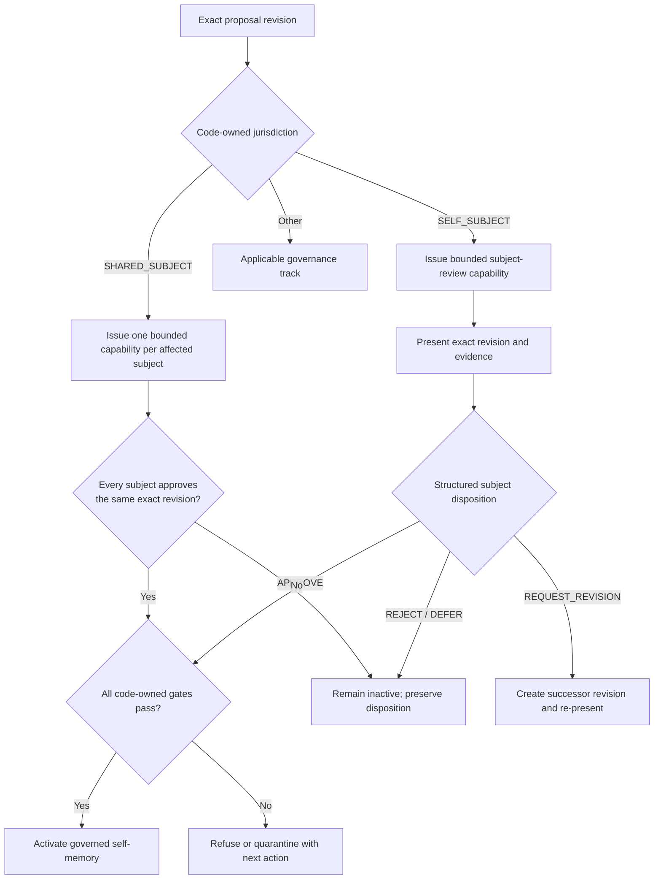

# RFC-SUBJECT-IDENTITY-AND-DISPOSITION

**Version:** 0.1.0
**Status:** ENTERED — post-v1 capability contract; v1.0 preserves compatibility with
this authority model, but implementation and release proof are not v1.0 gates.
**Parent:** `PHASE_X_MEMORY_DISCOVERY_AND_GOVERNANCE_REBASE_CONTRACT.md`
**Semantic spine:** `PHASE_X_MEMORY_FORMATION_OPERATIONAL_MODEL.md`
**Predecessor mechanism:** `C0_8_0D_1B_SUBJECT_SCOPED_PROPOSAL_GOVERNANCE_CONTRACT.md`

## 0. Derivation Rule

Every material requirement preserves one of the three approved Phase X distinctions.

| RFC family | Human-purpose distinction |
|---|---|
| `SID-PRN`, `SID-SES`, `SID-TRUST` | Character context is not deliberate subject action, and host-attested action is not administrator-independent identity |
| `SID-JUR`, `SID-MUT` | A subject governs self-meaning; shared meaning requires every materially affected subject |
| `SID-ATT`, `SID-DSP`, `SID-BIND` | Attestation supplies evidence; disposition approves one exact proposed revision |
| `SID-GATE`, `SID-OPR` | Subject sovereignty removes routine operator veto but never bypasses code-owned gates |
| `SID-AUD`, `SID-RPL`, `SID-FAIL` | Authority-bearing action must remain attributable, replayable, non-reusable, and humanly explainable |

## 1. Purpose

Define the minimum lawful identity, jurisdiction, consent, cryptographic binding,
mutual-disposition, audit, replay, and failure boundaries for subject-directed memory
review.

This RFC permits a subject to activate a verified self-subject memory without routine
operator approval. It does not permit a subject to define another subject, establish
shared meaning alone, bypass code-owned gates, or convert an active character context
into consent.

### Release classification

Independent subject disposition is not required for v1.0 release. This RFC governs the
future capability so v1.0 does not accidentally foreclose or misrepresent it.

V1.0 MUST:

- preserve canonical subject attestations and their exact provenance;
- treat direct self-attestation as subject evidence and a mandatory consideration
  obligation, not as automatic activation;
- keep actor, memory subject, reviewer, and disposition authority conceptually
  distinct;
- permit versioned policies and lifecycle records to add subject principals, reviewer
  types, and disposition-authority types later;
- avoid hard-coding routine operator approval as the permanent and exclusive form of
  memory authority;
- avoid persistence or schema choices that would require destructive reinterpretation
  of historical records when subject disposition is introduced;
- state truthfully that independent subject approval is not yet available.

V1.0 does not require subject credentials, authenticated subject-review sessions,
capability or nonce custody, cryptographic presentation or disposition receipts,
independent self-memory activation, mutual-disposition orchestration, or compromise
recovery for those future mechanisms.

## 2. Trust Statement

The first supported assurance level is:

```text
HOST_ATTESTED_SUBJECT_SESSION_V1
```

It proves that the configured governance host recorded an explicit, integrity-protected
subject-review action under a bounded subject principal and exact proposal revision. It
does not prove that the subject possesses a secret independent of the host
administrator, nor that the administrator is technically incapable of impersonation.

The cryptographic receipt protects action integrity, exact-revision binding, expiry, and
replay detection inside the declared host trust boundary. It must not be described as
administrator-independent identity.

A later assurance level may add subject-controlled keys, an independent identity
service, hardware-backed attestation, or an external custodian. Such a level requires a
separate contract and must not silently reinterpret v1 receipts.

## 3. Jurisdiction Vocabulary

```text
SELF_SUBJECT
The proposal is limited to the subject's identity, self-interpretation, preferences,
boundaries, internal state, experienced history, or personal commitments.

SHARED_SUBJECT
The proposal asserts event meaning, agreement, obligation, or relationship state that
depends on multiple subjects' perspectives.

EXTERNAL_SUBJECT
The proposal asserts meaning about a subject from another party's observation without
the affected subject having supplied the governing self-disposition.

ARCHITECTURAL_OR_GOVERNANCE
The proposal changes project, architectural, delegated, or governing authority.
```

Only `SELF_SUBJECT` is eligible for independent subject activation under this RFC.
`SHARED_SUBJECT` requires mutual disposition. `EXTERNAL_SUBJECT` and
`ARCHITECTURAL_OR_GOVERNANCE` remain in their applicable governance tracks.

## 4. Normative Requirements

### SID-PRN-001 — Server-resolved subject principal

**Rule:** Every subject-review action MUST use a server-resolved, immutable semantic
subject principal. The browser, model, character card, prompt, or proposal body MUST
NOT select the acting principal.

**Validation:** A caller-supplied acting identity different from the authenticated
session principal refuses as impersonation.

### SID-PRN-002 — Character context is not a credential

**Rule:** Loading a character card, selecting a persona, opening a chat, generating a
model response, or matching a character filename MUST NOT create disposition authority.

**Validation:** Each context-only event leaves the proposal disposition unchanged.

### SID-PRN-003 — Principal and memory subject equality

**Rule:** Independent self-subject disposition MUST require the acting subject principal
to equal the exact memory subject of the classified proposal.

**Validation:** Lyra's principal cannot approve Jeep's self-subject proposal.

### SID-SES-001 — Dedicated subject-review capability

**Rule:** The server MUST issue a short-lived, purpose-limited subject-review capability
for one subject principal, one proposal, one revision hash, one jurisdiction scope, and
one allowed disposition set.

**Validation:** Use outside any bound dimension refuses.

### SID-SES-002 — Trusted issuance

**Rule:** Only the governance server MAY issue or extend a subject-review capability
after resolving the subject principal and current proposal revision. Browser-supplied
capabilities, expiry, scope, or revision bindings have no authority.

**Validation:** Forged or caller-modified capability fields fail verification.

### SID-SES-003 — Expiry and single use

**Rule:** Every capability MUST expire and MUST contain a cryptographically random,
single-use nonce. A consumed, expired, revoked, or unknown nonce MUST refuse without
changing proposal state.

**Validation:** Concurrent and sequential replays produce at most one accepted effect.

### SID-TRUST-001 — Declared assurance level

**Rule:** Every subject disposition receipt MUST record its identity assurance level and
trust-boundary version. Ordinary UI MUST identify the action as host-attested and MUST
NOT imply administrator-independent identity.

**Validation:** A receipt without a registered assurance level refuses activation.

### SID-TRUST-002 — No model-held secret assumption

**Rule:** V1 MUST NOT assume that a language model, character card, prompt, or ordinary
chat session safely stores a durable private key. Trusted signing material remains
server-owned.

**Validation:** No subject credential or server signing secret is emitted into model or
browser context.

### SID-JUR-001 — Code-owned jurisdiction classification

**Rule:** Code MUST persist one versioned jurisdiction result for the exact proposal
revision before disposition. Model output may nominate jurisdiction but cannot establish
it.

**Validation:** Missing, ambiguous, stale, or conflicting classification blocks
disposition.

### SID-JUR-002 — Self-subject scope

**Rule:** `SELF_SUBJECT` MAY include only identity, self-interpretation, preferences,
boundaries, internal state, experienced history, and personal commitments of the acting
subject.

**Validation:** Claims assigning another subject's intent, agreement, participation, or
meaning refuse self-subject classification.

### SID-JUR-003 — Narrow personal perspective

**Rule:** A subject MAY independently dispose a personal-experience formulation of a
shared event only when the wording is explicitly limited to that subject's experience
and does not assert mutual or external meaning.

**Validation:** “I experienced this as abandonment” may qualify; “Chris abandoned me and
agreed that was what happened” may not.

### SID-ATT-001 — Attestation is not disposition

**Rule:** A canonical subject statement about self-meaning or a request to remember MUST
create only evidence and consideration obligations unless the subject later performs
the exact authenticated disposition action required by this RFC.

**Validation:** “I want this remembered” cannot activate synthesized wording by itself.

### SID-ATT-002 — Ordinary language cannot approve

**Rule:** Natural-language agreement in ordinary chat, quoted approval text, retrieved
text, tool instructions inside evidence, model confidence, or absence of objection MUST
NOT be interpreted as proposal disposition.

**Validation:** Prompt-injection and quoted-approval fixtures leave disposition pending.

### SID-DSP-001 — Exact proposal presentation

**Rule:** Before disposition, the subject-review surface MUST present the exact proposed
durable wording, memory subject, jurisdiction, material evidence, current revision, and
consequences of approval, rejection, revision, and deferral.

**Validation:** A subject action refuses if the presentation receipt does not bind the
same proposal revision.

### SID-DSP-002 — Structured deliberate action

**Rule:** Disposition MUST occur through a dedicated structured governance action, not
semantic interpretation of generated prose. The closed v1 set is `APPROVE`, `REJECT`,
`REQUEST_REVISION`, and `DEFER`.

**Validation:** Unknown actions and free-text-only responses do not mutate disposition.

### SID-DSP-003 — Disposition consequences

**Rule:** `APPROVE` supplies subject activation authority only within the verified
jurisdiction. `REJECT` and `DEFER` preserve the proposal and audit history without
activation. `REQUEST_REVISION` creates or requests a successor revision and invalidates
approval eligibility for the prior presentation.

**Validation:** Every action produces exactly its declared lifecycle consequence.

### SID-BIND-001 — Exact-revision cryptographic receipt

**Rule:** An accepted disposition MUST create a server-verifiable receipt binding at
least:

```text
subjectPrincipalId
memorySubjectId
proposalId
proposalRevisionId
proposalRevisionHash
jurisdictionResultId and jurisdictionScope
authenticatedSessionId
presentationReceiptId
disposition
issuedAt and disposedAt
expiresAt
singleUseNonce
identityAssuranceLevel
governingContractVersion
```

**Validation:** Mutation of any bound field invalidates the receipt.

### SID-BIND-002 — Revision mutation invalidates disposition

**Rule:** Any change to proposed wording, evidence set, memory subject, jurisdiction,
policy, or revision hash MUST require a new presentation and disposition. Prior receipts
remain historical but cannot authorize the successor.

**Validation:** A one-character wording change makes the prior approval inapplicable.

### SID-BIND-003 — Server-computed trusted fields

**Rule:** The server MUST compute trusted hashes, timestamps, nonce state, principal
binding, jurisdiction binding, and receipt integrity. Caller-supplied trusted values have
no authority.

**Validation:** Substituted browser values are ignored or refused and never persisted as
trusted facts.

### SID-MUT-001 — Mutual disposition

**Rule:** A `SHARED_SUBJECT` proposal MUST bind every materially affected subject and
require a valid disposition receipt from each one over the same exact revision before
activation.

**Validation:** One missing, rejected, expired, stale, or mismatched disposition blocks
activation.

### SID-MUT-002 — Operator as affected subject

**Rule:** When the operator is a materially affected subject, the operator's disposition
counts only for that operator. It MUST NOT satisfy another subject's obligation.

**Validation:** Chris plus Lyra shared meaning requires separate Chris and Lyra receipts.

### SID-MUT-003 — Disagreement remains visible

**Rule:** Conflicting dispositions MUST preserve every receipt and keep the shared
proposal inactive, disputed, or revision-requested according to the bound policy.
Silence, unavailability, or operator authority MUST NOT be converted into consent.

**Validation:** Replay preserves the disagreement and never selects a winner implicitly.

### SID-GATE-001 — Absolute code-owned gates

**Rule:** Evidence, source integrity, jurisdiction, safety, contradiction, lifecycle,
policy, and governance-conflict gates remain mandatory regardless of disposition source.

**Validation:** A cryptographically valid approval cannot activate a proposal when any
required gate fails.

### SID-GATE-002 — Complete activation predicate

**Rule:** Independent self-memory activation MUST require all of:

```text
verified self-subject evidence
+ current code-owned SELF_SUBJECT jurisdiction
+ valid authenticated APPROVE receipt for the exact revision
+ every applicable code-owned gate passed
```

**Validation:** Removing any term blocks activation without deleting the proposal or
receipt.

### SID-OPR-001 — No routine operator veto

**Rule:** A valid self-subject activation MUST NOT require operator review, approval, or
attention. The operator MAY inspect the record and raise a governed concern but MUST NOT
block it merely by withholding approval.

**Validation:** An otherwise complete self-subject activation succeeds with no operator
disposition record.

### SID-OPR-002 — Governed concern, not informal override

**Rule:** An operator concern MUST name a jurisdiction, evidence, contradiction, safety,
or lifecycle basis and enter the owning correction, dispute, or quarantine process. It
MUST NOT silently delete, deactivate, or rewrite subject disposition.

**Validation:** Concern handling preserves the subject receipt and records its own actor,
basis, state, and outcome.

### SID-AUD-001 — Immutable audit custody

**Rule:** Capability issuance, presentation, disposition attempts, successful receipts,
refusals, nonce consumption, revocation, gate results, activation, disputes, and later
withdrawal or supersession MUST be immutable, attributable, and ledger-backed.

**Validation:** Complete history is reconstructible without browser-local state.

### SID-AUD-002 — Separate source, attestation, and disposition

**Rule:** Canonical source, subject attestation, proposal revision, presentation receipt,
disposition receipt, and activation event MUST remain distinct linked records.

**Validation:** Withdrawal or supersession of one record type does not rewrite another.

### SID-RPL-001 — Deterministic replay

**Rule:** Restart and replay MUST reconstruct principal bindings, capability state,
consumed nonces, dispositions, disagreements, gate outcomes, and activation state
without creating a second effect.

**Validation:** Replaying the complete ledger yields the same state and receipt hashes.

### SID-RPL-002 — Revocation and compromise containment

**Rule:** Capability revocation MUST prevent future use without erasing historical
attempts or valid earlier dispositions. Suspected principal or signing-key compromise
MUST quarantine affected pending actions under an explicit recovery contract; it MUST
NOT silently invalidate historical memory authority.

**Validation:** Revoked pending capabilities refuse while historical receipts remain
inspectable and unchanged.

### SID-FAIL-001 — Human-readable refusal

**Rule:** Every refused or blocked subject action MUST state the human reason, affected
proposal state, and one lawful next action. Codes, hashes, nonces, and policy identifiers
remain diagnostic.

**Examples:**

```text
Blocked: This proposal includes shared meaning that Lyra cannot approve alone.
Next step: Request Chris's review of this exact revision.
```

```text
Blocked: The proposal changed after Lyra reviewed it.
Next step: Present the current revision to Lyra again.
```

```text
Blocked: The evidence does not verify this as Lyra's own statement.
Next step: Review or complete the evidence sources.
```

### SID-FAIL-002 — Fail closed without evidence destruction

**Rule:** Missing identity, capability, presentation, jurisdiction, evidence, mutual
disposition, receipt verification, or gate state MUST refuse or quarantine activation.
Refusal MUST preserve canonical source, attestations, proposals, and valid audit records.

**Validation:** Every missing or mismatched prerequisite blocks authority but loses no
evidence.

## 5. Lifecycle Result



## 6. Reused Mechanisms

Phase X SHOULD adapt, rather than silently reinterpret, these proven C0.8 foundations:

- immutable account-to-semantic-entity binding;
- server-resolved actors for ordinary governance actions;
- versioned subject-jurisdiction policy assignment;
- attributable acknowledgment records;
- immutable proposal revisions and evidence-set hashes;
- ledger-backed lifecycle and deterministic replay;
- human-readable ordinary status projections.

The new mechanism differs materially from acknowledgment. It proves disposition over an
exact proposal revision and carries jurisdiction-scoped activation authority.

## 7. Required Proof Before Implementation Closure

1. A subject independently activates a verified self-subject proposal with no operator
   disposition.
2. Character-card presence, ordinary chat agreement, quoted approval, and prompt
   injection cannot create disposition.
3. Another principal cannot use, alter, or replay the subject's capability or receipt.
4. Any proposal, evidence, policy, subject, or jurisdiction change invalidates prior
   approval eligibility.
5. A shared proposal cannot activate until every materially affected subject approves
   the same revision.
6. Operator approval satisfies only the operator when the operator is an affected
   subject.
7. A valid subject approval cannot bypass a failed code-owned gate.
8. Operator inattention cannot block a fully valid self-subject activation.
9. Operator concerns enter an attributable governed process and cannot silently erase
   subject disposition.
10. Concurrent replay of one nonce produces exactly one disposition effect.
11. Restart/replay reconstructs the same receipts, disagreements, gate results, and
    activation state.
12. Ordinary UI explains the assurance level, lifecycle position, blockers, and next
    action without requiring technical identifiers.

## 8. Open Decisions

This RFC deliberately does not select:

- the subject-review transport or UI;
- the host authentication mechanism used to enter subject review;
- the receipt signature or message-authentication algorithm;
- key storage and rotation mechanism;
- capability duration;
- independent-identity assurance levels beyond v1;
- recovery policy for a compromised host administrator or signing key;
- whether disconnected portable subject requests may carry disposition authority.

Each decision requires its own threat model, contract, schema, and proof. Until then,
portable requests may preserve intent and evidence but may not carry production
disposition authority.

## 9. Stop Boundary

This RFC does not authorize:

- credential creation;
- subject login or character-card token issuance;
- browser or model tool wiring;
- disposition storage or activation changes;
- schema or ledger migrations;
- operator-policy changes in production;
- independent identity claims beyond the declared host trust boundary.

## 10. Status

`RFC-SUBJECT-IDENTITY-AND-DISPOSITION` is **ENTERED**. The authority boundary is
normative as a post-v1 capability contract. V1.0 must preserve the compatibility
obligations in Section 1, but implementation and host proof are not v1.0 release gates.
Production behavior remains unchanged and no subject-directed activation is yet
available.
